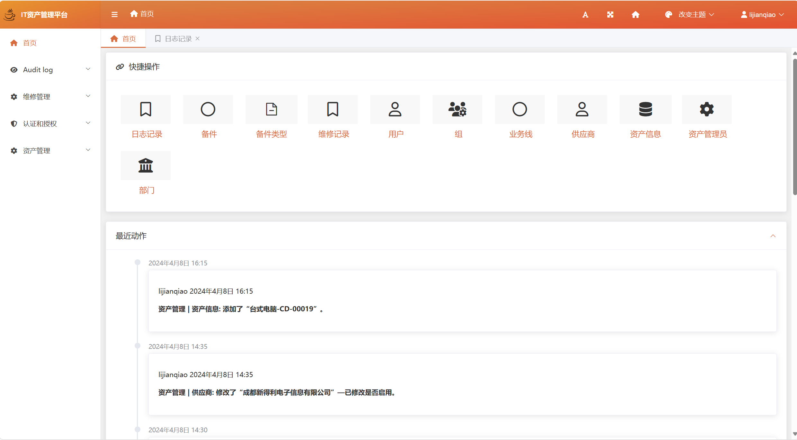
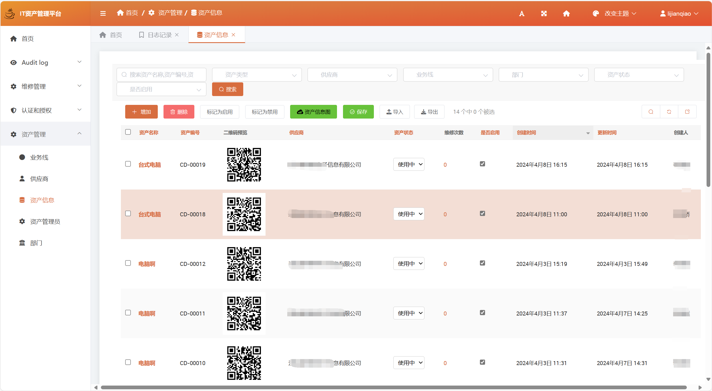
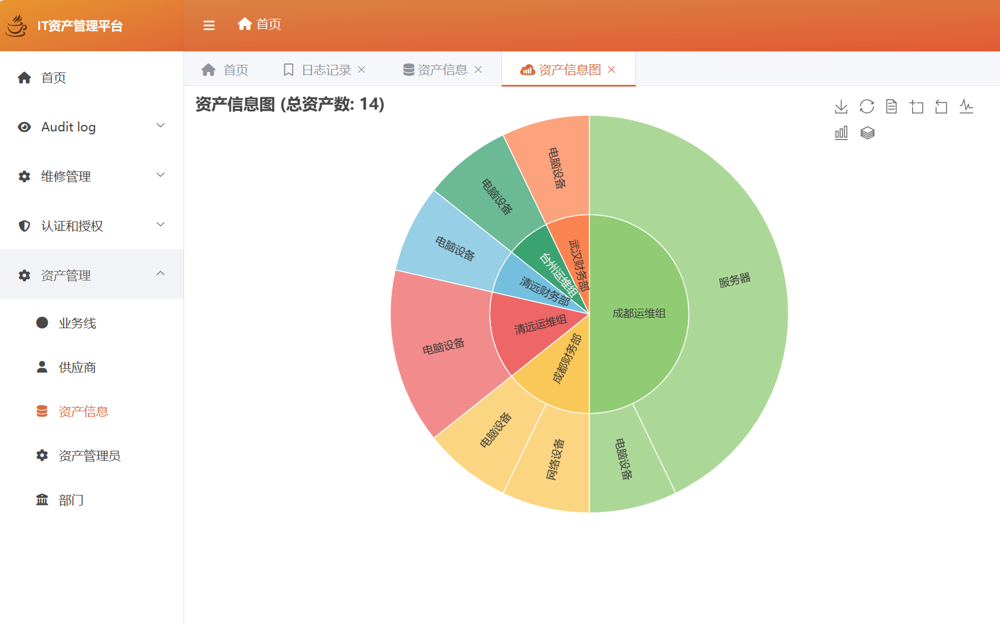
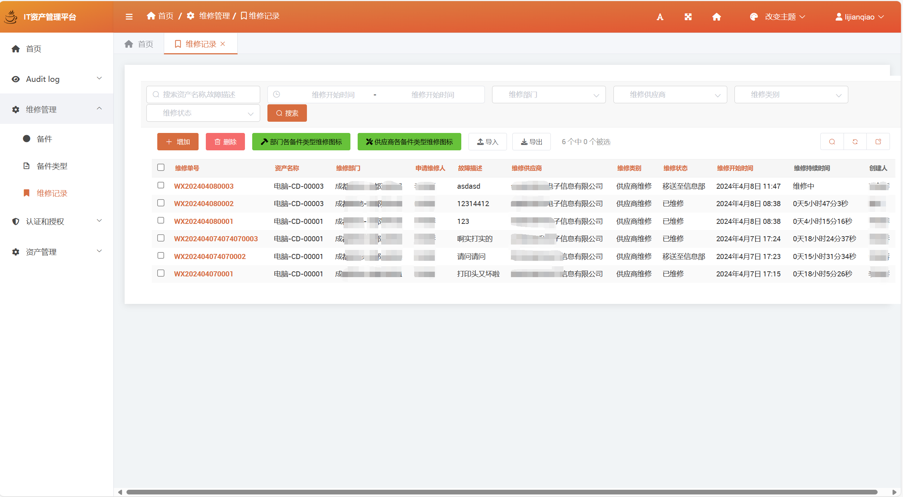
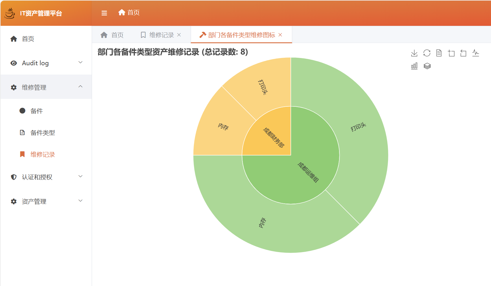
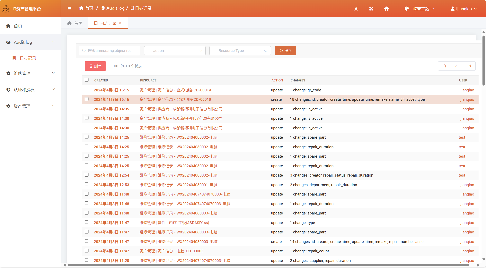

# IT资产管理平台

IT资产管理平台是一个使用Django框架开发的Web应用，用于管理公司的IT资产。

## 主要特性

- 资产管理：允许您在一个地方管理所有的IT资产。您可以添加、更新和删除资产。您还可以将资产标记为活动或非活动。
- 维修管理：允许您管理IT资产的维修记录。您可以添加、更新和删除维修记录。您还可以查看维修持续时间和状态。
- 部门和供应商管理：允许您管理部门和供应商。您可以添加、更新和删除部门和供应商。
- 二维码生成：为每个资产生成一个二维码，以便于识别和管理。
- 图表：提供用于可视化资产和维修数据的图表。
- 支持审计日志

## 开发环境

- Python
- Django
- MySQL
- SimpleUI

## 如何运行

1. 克隆项目到本地, 请将`ITAssets/.env.example`文件重命名为`.env`
2. 在`ITAssets/`项目目录下创建`media`和`static`目录
3. 安装依赖：`pip install -r requirements.txt`
4. 修改`ITAssets/.env`中的配置
5. 生成静态文件：`python manage.py collectstatic`
6. 运行迁移：`python manage.py makemigrations` `python manage.py migrate`
7. 创建超级用户：`python manage.py createsuperuser`
8. 运行服务器：`python manage.py runserver`
9. 打开浏览器，访问：`http://localhost:8020/admin`

## 项目结构

- `assets/`：资产管理应用，包含模型定义、Admin定义, views视图包含资产信息图表
- `utils/`：工具类，包含二维码生成等
- `repair/`：维修管理应用，包含模型定义、Admin定义, views视图包含资产维修记录图表
- `ITAssets/`：项目配置目录，包含settings.py、urls.py等
- `media/`：存储上传的文件，如资产的二维码图片
- `static/`：存储静态文件，如CSS、JavaScript等
- `templates/`：存储HTML模板文件

# 项目展示

- 主页
  
- 资产信息及图表
  
  
- 维修信息及图表
  
  
  
- 日志
  

## 联系方式

如果你有任何问题或建议，欢迎联系我：lijianqiao2906@live.com